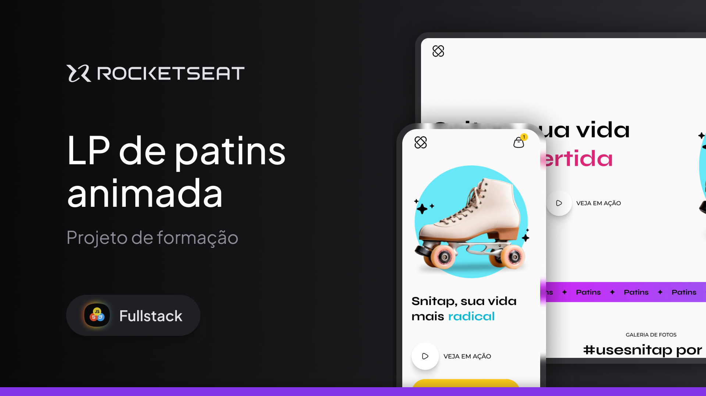

<h1 align="center"> Snaptap Landing Page</h1>

This project involves creating an animated landing page for the fictional Snaptap rollerblades. It is part of the Fullstack course by Rocketseat.

  <a href="#-tecnologias">Technologies</a>&nbsp;&nbsp;&nbsp;|&nbsp;&nbsp;&nbsp;
  <a href="#-projeto">Project</a>&nbsp;&nbsp;&nbsp;|&nbsp;&nbsp;&nbsp;
  <a href="#-layout">Layout</a>&nbsp;&nbsp;&nbsp;|&nbsp;&nbsp;&nbsp;
  <a href="#memo-licença">License</a>

  

 

  

## 🚀 Technologies
This project was developed with the following technologies:
- HTML and CSS
- Git and Github
- Figma

## 💻 Project
Responsive marketing landing page for Zingen, a Karaoke app.
- [Access the finished project]()
- [Watch the classes](https://www.rocketseat.com.br/formacao/fullstack)

## 🔖 Layout
You can view the project layout through [LINK](https://www.figma.com/community/file/1379866810042169871). You must have an account on [Figma](https://figma.com) to access it.

## :memo: License
This project is under the MIT license.

---
Made with ♥ by Rocketseat :wave: [Join our community!](https://discord.gg/rocketseat)